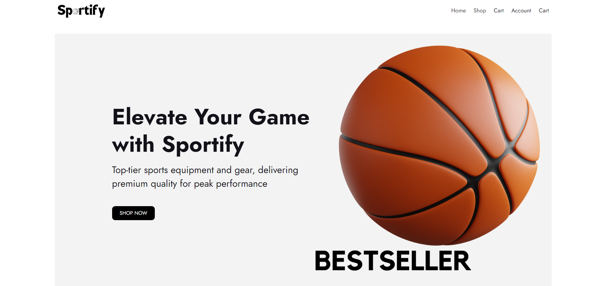
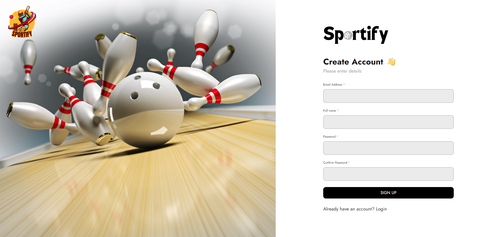

# Sportify

Sportify one-stop-shop for all your fitness needs! Our e-commerce platform specializes in providing top-quality sport and gym equipment, stylish sportswear, trendy accessories, and authentic team jerseys for all sports enthusiasts and fitness aficionados.

## Technologies Used

The following technologies and tools were used to develop this project:

- SCSS
- JavaScript
- Typescript
- Next.js
- Node.js
- Express.js
- MongoDB
- Stripe

## Getting Started

Follow these steps to get the project up and running on your local machine for development and testing:

### Prerequisites

Make sure you have the following requirements met:

- Latest version of npm and Node.js installed.
- Windows/Linux/Mac machine.

### Installation

To run Sportify locally, follow these steps:

1. Clone the repository

   ```bash
   git clone https://github.com/username/projectname.git
   ```

2. Move into the project directory

   ```bash
   cd projectname
   ```

3. Install the dependencies

   ```bash
   npm install
   ```

4. Set up the database.
5. Run the application:

    ```bash
    npm run dev
    ```

6. Open your web browser and navigate to `http://localhost:3000` to access the website.

### Screenshots




## Contributing

Contributions to this projects are welcome! To contribute, follow these steps:

1. Fork the repository.
2. Create a new branch for your feature or bug fix:

    ```bash
    git checkout -b feature/your-feature-name
    ```

3. Make changes and commit them:

    ```bash
    git commit -m "Add your commit message here"
    ```

4. Push your changes to your branch:

    ```bash
    git push origin feature/your-feature-name
    ```

5. Create a pull request on the main repository.

Please follow the project's coding guidelines and maintain a clean commit history.

## License

This website is licensed under the MIT License. See the [LICENSE](LICENSE) file for details.

## Contact

If you have any questions or feedback, feel free to reach out to me at <therahman14@gmail.com>. I'm excited to hear from you and make this project even better!
